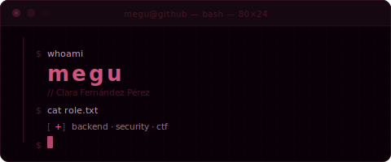

<div align="center">



</div>

---

<div align="center">

[](https://git.io/typing-svg)

[](/)
[](/)
[](/)

</div>

```
╔══════════════════════════════════════════════════════╗
║  name      →  megu · Clara Fernández Pérez          ║
║  role      →  student · junior backend developer    ║
║  focus     →  programming · linux · cybersecurity   ║
║  os        →  ubuntu                                ║
║  currently →  self-hosting my own Ubuntu server 🌱  ║
╚══════════════════════════════════════════════════════╝
```

Backend developer with a security mindset. While I finish my studies, I live in the terminal and spend my free time on CTF challenges. I believe the best way to build secure systems is to understand exactly how they break. Currently setting up my own Ubuntu server to host personal projects — figuring it out as I go.

---

## `$ ls tech-stack/`

**Languages**


**Frameworks & Backend**


**Databases**


**Security**


**Observability & Testing**


**Tools & IDEs**


---

## `$ ls projects/`

| project | description | stack | status |
|---------|-------------|-------|--------|
| [**yovi_en1a**](https://github.com/Arquisoft/yovi_en1a) | Full-stack game platform — React/TS frontend, Node.js user service, and a Rust game engine with bot support. All containerized with Docker. |     | ✅ done |
| *next project...* | *coming soon* | | 🔧 wip |

---

## `$ cat currently_learning.sh`

```bash
TOPICS=(
  "Web pentesting — OWASP Top 10, SQLi, XSS, CSRF"
  "Privilege escalation on Linux"
  "JWT + OAuth2"
  "Docker for secure environments"
  "Traffic analysis with Wireshark"
  "CTF challenges on HackTheBox & TryHackMe"
  "Bash and Python automation"
  "Self-hosting on Ubuntu — my own server for personal projects"
)

for topic in "${TOPICS[@]}"; do echo "[ + ] $topic"; done
```

---

## `$ neofetch --stats`

<div align="center">


<br/>

[](https://github.com/ashutosh00710/github-readme-activity-graph)

</div>

---

## `$ whoami --contact`

<div align="center">

[](https://github.com/megu-hub)
[](https://www.linkedin.com/in/clara-fernández-54b5b9396/)
[](mailto:clarafdezprz@email.com)
[](https://profile.hackthebox.com/profile/019e49ca-2c68-70f3-afbc-c65377a897e0)
[](https://tryhackme.com/p/megu)

<br/>

[](https://git.io/typing-svg)

</div>

<br/>


